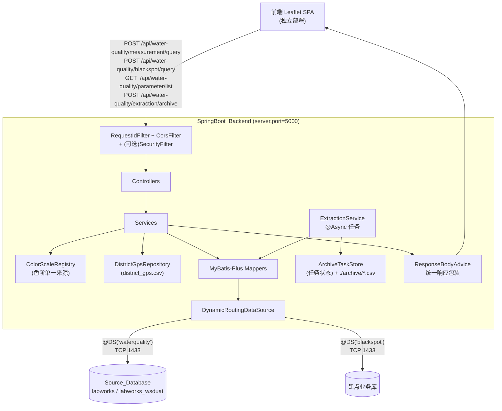
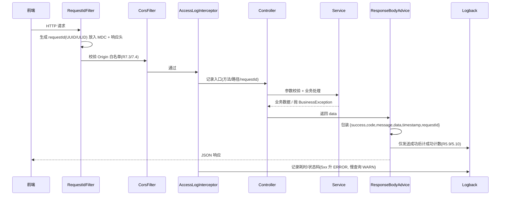
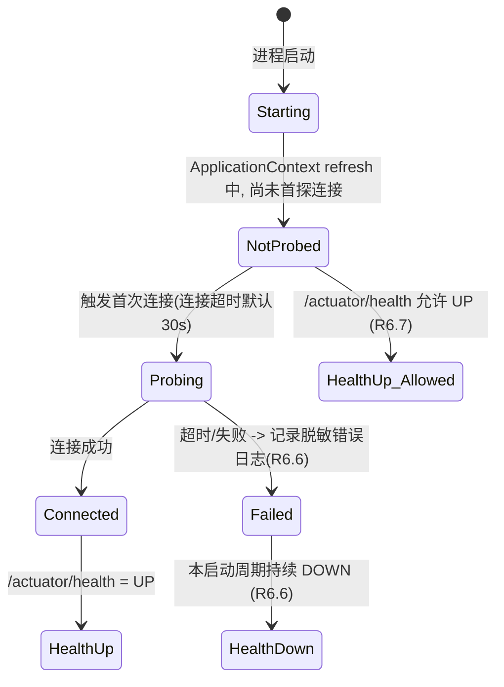

# Design Document

## Overview

（概述）

本设计文档面向《需求文档：springboot-backend-rewrite》，目标是把现有的 Python 后端（Flask + folium 服务端预生成 Leaflet HTML + 独立 `gencsv` 取数脚本）整体重写为一个 **Java Spring Boot 后端服务**，并落实需求中确定的"方案 B"：后端只对外输出 GeoJSON / JSON 数据接口，地图渲染全部交给前端 Leaflet.js。

### 设计目标

1. **数据采集内聚**：把原 `gencsv/` 模块（执行 `sqltemplate/*.sql`、按日期切片归档 CSV）的职责并入 Spring Boot 后端，统一通过 MyBatis 持久层直连上游 LIMS 数据库取数，不再保留独立 Python 脚本，不再依赖 CSV 中间文件作为查询数据源。
2. **接口数据化**：用 `POST /api/water-quality/measurement/query`、`POST /api/water-quality/blackspot/query` 等纯数据接口取代原 `/maps/output/*.html` 静态页服务，新后端不兼容旧路由。
3. **色阶单一来源**：把原 `cluster_map.py::get_color` 阈值规则与 `dashboard.html` Legend 色阶规则统一为后端单一来源（以 Legend 语义为准、废弃 `get_color` 旧阈值），同时供"参数元数据接口"对外输出与"水质 Feature 的 colorLevel 计算"内部复用。
4. **规范对齐**：全部 `/api/**` 接口遵循全局《接口设计规范》——路径风格 `/api/{module}/{?resource}/{action}`、统一响应包装、MyBatis-Plus 风格分页、camelCase 参数命名。

### 现状实证（来自代码阅读）

| 现状要素 | 实证来源 | 对新设计的影响 |
| --- | --- | --- |
| 取数 SQL 模板含 `[date_from]`/`[date_to]` 占位符，且当前以字符串替换为带引号字面量注入 | `gencsv/date_range_runner.py::process_sql_template`、`gencsv/sqltemplate/{cl2_free_1,ecoli,turby}.sql` | 迁移为 MyBatis `#{}` 参数绑定，禁止字符串拼接（R4.2 / R6.4） |
| `cl2_free_1.sql` / `turby.sql` 带 `TOP 1000` 硬限制；`ecoli.sql` 无 | 三个模板文件 | 迁移时移除硬编码 `TOP`，改由日期跨度 + 50000 Feature 上限（R1.13）控制结果集 |
| 采样查询输出列：`sampno / loccode / locdescr / current_state / coldate / owner / district(lower) / loc_gps_latitude / loc_gps_longitude / result / rawresult / *_value` | 三个 SQL 模板 | 决定 Data Model 字段映射；`result` 作为测量值、`district` 已小写 |
| 行政区中心点坐标表 `Location,District,Latitude,Longitude`，District 为小写 | `gencsv/missing_gps/district_gps.csv` | 作为 `district`/`district_all_param` 视图的几何坐标来源 |
| 黑点数据列：`case_id,lat,lon,location_desc,report_date` | `bp_data.csv`、`cluster_map_blackspot.py` | 决定 Blackspot Feature 字段映射 |
| 旧 Legend 色阶（chlorine 5 级 / ecoli 2 级 / turbidity 4 级）与 `get_color` 旧阈值（≤0.5/1.0/1.5/2.0）不一致 | `dashboard/templates/dashboard.html`、`cluster_map.py::get_color` | 以 Legend 为准、按 R3.4–3.6 连续区间重定义，废弃 `get_color` |
| 上游为 SQL Server，`labworks_wsduat`(uat)/`labworks`(prod)，端口 1433 | `gencsv/setting.ini` | 多数据源 + 外部化连接配置（R6） |
| 原服务端口 5000 | `dashboard/app.py` | 新后端默认 `server.port = 5000`（R7.6） |

> 说明：以上每条均来自对应文件的直接阅读，未凭印象引用。

---

## Architecture

（架构）

### 技术栈选型

| 维度 | 选型 | 理由 / 对应需求 |
| --- | --- | --- |
| 运行时 | Java 17 + Spring Boot 3.x（内嵌 Tomcat） | R7.1 内嵌容器独立启动、不做服务端 HTML 渲染 |
| 持久层 | **MyBatis-Plus（唯一 ORM）** | R6.1 二选一且不并存；MyBatis-Plus 内置分页插件（R5.7）、与多数据源 starter 集成良好；自定义 Mapper XML 可承载原 SQL 模板逻辑 |
| 多数据源 | `dynamic-datasource-spring-boot-starter`（baomidou）+ `@DS` 注解 | R6.5 ≥2 数据源、按 Mapper 路由且运行期唯一确定 |
| 连接池 | Druid（或 HikariCP） | 连接超时控制（R6.6）、慢 SQL 监控 |
| 数据库驱动 | `mssql-jdbc`（SQL Server, TCP 1433） | R6.2 |
| 鉴权 | Spring Security + 自定义过滤器（默认禁用） | R8 占位/默认禁用 |
| 日志 | SLF4J + Logback | R9 控制台 + `./logs/` 按日切割、保留 ≥30 天 |
| API 文档 | knife4j / springdoc（可选） | 便于前端联调（非强制需求） |
| GeoJSON 序列化 | 自定义 POJO + Jackson（不引入重型 GIS 库） | 仅输出 `FeatureCollection` / `Point`，无需 JTS |

> 关键设计决策见文末"关键设计决策待确认"，其中 ORM、多数据源实现方式、归档存储形态等列出了备选方案，当前正文按推荐默认值展开。

### 分层与包结构

采用单 Spring Boot 模块、经典分层包结构（基础包名 `com.watermap` 为占位，见决策 D8）：

```
com.watermap
├── WaterMapApplication.java          # 启动类
├── config/                           # 配置：CORS、MyBatis-Plus、数据源、Security、Async、Jackson
├── common/
│   ├── response/                     # ApiResponse<T> 统一响应包装、PageResult<T>
│   ├── exception/                    # BusinessException、GlobalExceptionHandler、ErrorCode 枚举
│   ├── web/                          # RequestIdFilter、AccessLogInterceptor
│   └── geojson/                      # FeatureCollection、Feature、PointGeometry（GeoJSON POJO）
├── metadata/                         # 参数元数据 + 色阶（单一来源）
│   ├── ColorScaleRegistry.java       # 色阶规则与 colorLevel 计算的唯一来源
│   ├── ParameterMetadataController/Service
├── measurement/                      # 水质测量查询（Water_Quality_Service）
│   ├── controller / service / mapper / dto / domain
├── blackspot/                        # 黑点查询（Blackspot_Service）
│   ├── controller / service / mapper / dto / domain
├── extraction/                       # 数据采集 / 归档（Data_Extraction_Module）
│   ├── controller / service / task / store
└── support/
    ├── DistrictGpsRepository.java    # 加载 district_gps.csv（行政区中心点）
    └── DateRangeSlicer.java          # 日期切片工具（归档批量预查）
```

### 运行时分层数据流



### 请求处理横切顺序



### 启动期数据源健康策略（R6.6 / R6.7 / R7.5）



---

## Components and Interfaces

（组件与接口）

每条 API 按全局《接口设计规范》给出五维度契约：**路径 / 方法 / 参数 / 响应 / 错误码 + 权限码**。所有 `/api/**` 响应均被统一包装为 `ApiResponse<T> = { success, code, message, data, timestamp, requestId }`（R5.1）。

### 接口路径汇总

| 模块 | 路径 | 方法 | 用途 | 权限码（启用鉴权时） |
| --- | --- | --- | --- | --- |
| water-quality / measurement | `/api/water-quality/measurement/query` | POST | 水质测量数据查询（GeoJSON） | `water-quality:measurement:query` |
| water-quality / blackspot | `/api/water-quality/blackspot/query` | POST | 黑点数据查询（GeoJSON） | `water-quality:blackspot:query` |
| water-quality / parameter | `/api/water-quality/parameter/list` | GET | 参数元数据 + 色阶规则 | `water-quality:parameter:list` |
| water-quality / extraction | `/api/water-quality/extraction/archive` | POST | 触发批量归档（手动 HTTP） | `water-quality:extraction:archive` |
| water-quality / extraction | `/api/water-quality/extraction/archive/detail/{taskId}` | GET | 查询归档任务状态 | `water-quality:extraction:archive` |
| actuator | `/actuator/health` | GET | 健康检查（不套统一包装，R5.8/R7.5） | 无 |

---

### 1. MeasurementController — 水质测量查询（Water_Quality_Service）

**接口 1.1：`POST /api/water-quality/measurement/query`**

- **请求体** `MeasurementQueryRequest`（`@RequestBody` JSON）：

| 字段 | 类型 | 必填 | 约束 |
| --- | --- | --- | --- |
| `parameter` | String | 是 | ∈ `{cl2_free_1, ecoli, turby, all_params}` |
| `dateFrom` | String | 是 | `YYYY-MM-DD` |
| `dateTo` | String | 是 | `YYYY-MM-DD` |
| `viewType` | String | 是 | ∈ `{district, detailed, district_all_param}` |

- **校验顺序（短路，命中第一个失败即返回）**：
  1. 字段必填 / 枚举合法性。
  2. `parameter`×`viewType` 组合合法性：`all_params` 仅允许 `district_all_param`（否则 `4001`，R1.6）；`{cl2_free_1,ecoli,turby}` 不允许 `district_all_param`（否则 `4002`，R1.7）。
  3. 日期格式 + `dateFrom <= dateTo`（否则 `4003`，message 指出第一个失败字段，R1.8）。
  4. 跨度 `dateTo - dateFrom <= 90` 天（否则 `4004`，R1.9）。
  5. 业务查询 → 剔除无效坐标累计计数（R1.10）→ 若有效 Feature > 50000 则 `4005`（R1.13）。

- **成功响应** `data` 结构（GeoJSON FeatureCollection + meta）：

```jsonc
{
  "success": true, "code": 200, "message": "",
  "data": {
    "type": "FeatureCollection",
    "features": [ /* 见下方按 viewType 的 Feature 形态 */ ],
    "meta": {
      "parameter": "cl2_free_1",
      "dateFrom": "2026-04-01", "dateTo": "2026-04-10",
      "viewType": "district",
      "featureCount": 12,                    // == features.length
      "droppedInvalidCoordinateCount": 3,
      "queryDurationMs": 87
    }
  },
  "timestamp": 1730000000000, "requestId": "01J..."
}
```

- **Feature 形态（properties 字段）**：

| viewType | geometry | properties 关键字段 |
| --- | --- | --- |
| `district`（R1.3） | Point，坐标取自 District_GPS 中心点 | `district`、`parameter`、`avgValue`(2位)、`maxValue`(2位)、`minValue`(2位)、`sampleCount`、`colorLevel` |
| `detailed`（R1.4） | Point，使用测点自身坐标 | `sampleNo`、`locationCode`、`locationDesc`、`collectedAt`(`YYYY-MM-DDTHH:mm:ss`,+08:00)、`parameter`、`value`(2位)、`unit`、`colorLevel` |
| `district_all_param`（R1.5，仅 all_params） | Point，District 中心点 | `district` + 每个 Parameter_Code 子对象（键名为 `cl2_free_1`/`ecoli`/`turby`），子对象含 `avgValue`(2位)、`colorLevel` |

- 坐标统一 `[longitude, latitude]`、WGS84、6 位小数（R1.2）；数值精度 2 位小数。
- 命中为零 → `code=200`、`features=[]`（R1.11）。
- `colorLevel` 由 `ColorScaleRegistry` 按测量值落入区间计算；测量值为 null/NaN 时 `colorLevel=null` 且保留 Feature（R3.8/R3.9）。
- **错误码**：`4001/4002/4003/4004/4005`；上游异常 `500`（R5.5）。
- **权限码**：`water-quality:measurement:query`。

---

### 2. BlackspotController — 黑点查询（Blackspot_Service）

**接口 2.1：`POST /api/water-quality/blackspot/query`**

- **请求体** `BlackspotQueryRequest`：`dateFrom`(`YYYY-MM-DD`，必填)、`dateTo`(`YYYY-MM-DD`，必填)。
- **校验**：必填 / 格式 / `dateFrom <= dateTo`（否则 `4003`，R2.3）；跨度 `<= 366` 天（否则 `4004`，message=`"Date range exceeds 366 days"`，R2.4）。
- **成功响应** `data`：GeoJSON FeatureCollection，每个 Feature：

```jsonc
{
  "type": "Feature",
  "geometry": { "type": "Point", "coordinates": [114.156100, 22.497500] },
  "properties": { "caseId": "0001", "locationDesc": "Queen's Hill Estate ...", "reportDate": "2025-05-30" }
}
```

- `data.meta`：`dateFrom`、`dateTo`、`featureCount`(==features.length)、`droppedInvalidCoordinateCount`、`queryDurationMs`（R2.7）。
- 无效坐标剔除并计数（R2.5）；命中为零 → `features=[]`（R2.6）。
- **性能约束**：Controller 入口到响应序列化完成 ≤ 5000ms（R2.8）。
- **权限码**：`water-quality:blackspot:query`。

> 备注：黑点字段映射来自 `bp_data.csv` / `cluster_map_blackspot.py`（`case_id/lat/lon/location_desc/report_date`）。真实黑点业务库的表名与 SQL 暂无模板，需在实现前确认（决策 D6）。

---

### 3. ParameterMetadataController — 参数元数据与色阶（Parameter_Metadata_Service）

**接口 3.1：`GET /api/water-quality/parameter/list`**

- **参数**：无 query / path / body（R3.1）。
- **成功响应** `data`：JSON 数组，≥4 个元素（`cl2_free_1`/`ecoli`/`turby`/`all_params`），每元素：

```jsonc
{
  "parameter": "cl2_free_1",
  "displayName": "Free Chlorine",
  "unit": "mg/L",
  "colorScale": [
    { "level": "Insufficient",  "color": "#00BCD4", "min": null, "max": 0.2, "description": "< 0.2" },
    { "level": "Satisfactory",  "color": "#198754", "min": 0.2,  "max": 1.5, "description": "0.2 – 1.5" },
    { "level": "Slightly High", "color": "#FFC107", "min": 1.5,  "max": 2.0, "description": "1.6 – 2.0" },
    { "level": "High",          "color": "#FD7E14", "min": 2.0,  "max": 3.0, "description": "2.1 – 3.0" },
    { "level": "Very High",     "color": "#DC3545", "min": 3.0,  "max": null,"description": "> 3.0" }
  ]
}
```

- `colorScale` 按 `min` 升序（null 视为负无穷排最前），元素含 `level`/`color`(7字符HEX含#)/`min`(含端点,null=−∞)/`max`(不含端点,null=+∞)/`description`（R3.2/R3.3）。
- `cl2_free_1` 5 级、`ecoli` 2 级、`turby` 4 级，区间连续无间隙且覆盖 (−∞,+∞)（R3.4/R3.5/R3.6）。
- `all_params` 的 `colorScale` = `cl2_free_1`(5) + `ecoli`(2) + `turby`(4) 共 11 元素，**同源复用**子参数定义（R3.7）。
- **权限码**：`water-quality:parameter:list`。
- 该接口与 `MeasurementService` 计算 `colorLevel` 共用同一个 `ColorScaleRegistry`，确保后端着色与前端图例 100% 同源（R3.8）。

---

### 4. ExtractionController — 数据采集 / 归档（Data_Extraction_Module）

**接口 4.1：`POST /api/water-quality/extraction/archive`**（手动触发批量归档，同步返回任务编号，异步执行）

- **请求体** `ArchiveRequest`：

| 字段 | 类型 | 必填 | 约束 |
| --- | --- | --- | --- |
| `parameter` | String | 是 | ∈ Parameter_Code |
| `dateFrom` | String | 是 | `YYYY-MM-DD` |
| `dateTo` | String | 是 | `YYYY-MM-DD` |
| `rangeDays` | Integer | 是 | 每片窗口天数，1–365 |
| `stepDays` | Integer | 否 | 步长，1–365，默认 1 |

- **校验失败**：同步返回 `code=4xxx`、message 指出第一个失败字段，且**不启动**归档任务（R4.4）。
- **成功响应**（同步 ≤5s，R4.3）：`data = { "taskId": "...", "status": "PENDING" }`。
- 归档异步执行：`DateRangeSlicer` 按 `rangeDays`/`stepDays` 生成窗口（沿用 `date_range_runner.generate_date_ranges` 的"回看窗口"语义），逐片执行 MyBatis 参数化查询，落 CSV 到 `./archive/`，命名 `{parameter}_{dateFrom}_{dateTo}_{timestamp}.csv`，`timestamp=yyyyMMdd_HHmmss`（R4.5）。
- 单片失败记录错误条目并继续；≥1 成功且 ≥1 失败 → `PARTIAL_SUCCESS`；全失败 → `FAILED`（R4.7）。
- 每片执行前后输出结构化日志 `{任务编号,参数代码,日期范围,命中行数,耗时ms}`，级别 `INFO`（R4.8）。
- **权限码**：`water-quality:extraction:archive`。

**接口 4.2：`GET /api/water-quality/extraction/archive/detail/{taskId}`**

- **参数**：`taskId`（`@PathVariable`）。
- **成功响应** `data`（R4.6）：

```jsonc
{
  "taskId": "...",
  "status": "PARTIAL_SUCCESS",          // PENDING|RUNNING|SUCCESS|PARTIAL_SUCCESS|FAILED
  "successCount": 8, "failedCount": 2,
  "products": [
    { "dateFrom": "2026-04-01", "dateTo": "2026-04-07",
      "storagePath": "./archive/cl2_free_1_2026-04-01_2026-04-07_20260520_101500.csv",
      "sliceStatus": "SUCCESS", "rowCount": 320, "durationMs": 145 }
  ],
  "errors": [
    { "parameter": "cl2_free_1", "dateFrom": "2026-04-08", "dateTo": "2026-04-14",
      "reason": "SQL execution failed: ...", "failedAt": 1730000000000 }
  ]
}
```

- **权限码**：`water-quality:extraction:archive`。

---

### 5. 横切组件

| 组件 | 职责 | 对应需求 |
| --- | --- | --- |
| `ApiResponse<T>` / `PageResult<T>` | 统一响应包装、MyBatis-Plus 风格分页 `{records,total,size,current,pages}` | R5.1/R5.2/R5.7 |
| `ApiResponseBodyAdvice` | 对 `/api/**` 自动包装；放行 `/actuator/**` 等非 `/api/**` 路径 | R5.1/R5.8 |
| `RequestIdFilter` | 为每请求生成 UUID(36)/ULID(26)，写入 MDC + 响应头 `X-Request-Id`；进程内不重复 | R5.6/R9.2 |
| `GlobalExceptionHandler` | `@RestControllerAdvice` 捕获业务/校验/系统异常，映射错误码，脱敏 message，记录完整堆栈+requestId | R5.3/R5.4/R5.5/R5.10 |
| `AccessLogInterceptor` | 出口访问日志 `{方法,路径,requestId,状态码,耗时}`；5xx 升 ERROR；慢查询(默认>3000ms) WARN | R9.2/R9.3 |
| `CorsConfig` | 对 `/api/**` 配置 CORS：方法 GET/POST/OPTIONS；头 Content-Type/Authorization/X-Request-Id；`allowCredentials=false`；Origin 取自 `app.cors.allowed-origins`；白名单缺失/为空时不放行任何 Origin 并 403 不写 CORS 头 | R7.3/R7.4 |
| `SecurityConfig` + `TokenAuthFilter` | `app.security.enabled=false`（默认）放行全部并启动 WARN 固定文本；`=true` 校验 `Authorization: Bearer`，失败 401，缺权限码 403 | R8 |
| `ColorScaleRegistry` | 色阶规则 + `colorLevel` 计算的唯一来源 | R3 全体 |
| `DistrictGpsRepository` | 启动加载 `district_gps.csv`，提供 `district(小写) → (lat,lon)` 查询 | R1.3/R1.5 |
| `DynamicRoutingDataSource` | 按 `@DS` 注解路由水质 / 黑点数据源，运行期唯一确定 | R6.5 |
| `ArchiveTaskStore` | 归档任务状态与产物清单存储 | R4.6/R4.7 |
| `DateRangeSlicer` | 按 `rangeDays`/`stepDays` 生成日期窗口 | R4.3/R4.5 |

---

## Data Models

（数据模型）

### 4.1 统一响应与分页

```java
public class ApiResponse<T> {
    private boolean success;     // R5.1
    private int code;            // [100,9999]
    private String message;      // 0–500 字符
    private T data;
    private Long timestamp;      // UTC epoch 毫秒
    private String requestId;    // 26位ULID 或 36位UUID
}

public class PageResult<T> {     // MyBatis-Plus 风格（R5.7）
    private List<T> records;
    private long total;
    private long size;
    private long current;
    private long pages;
}
```

### 4.2 GeoJSON 输出模型（仅 FeatureCollection / Point）

```java
public class FeatureCollection {
    private final String type = "FeatureCollection";
    private List<Feature> features;
    private FeatureCollectionMeta meta;   // data.meta
}
public class Feature {
    private final String type = "Feature";
    private PointGeometry geometry;
    private Map<String, Object> properties;   // 不同 viewType 字段不同
}
public class PointGeometry {
    private final String type = "Point";
    private double[] coordinates;   // [longitude, latitude], WGS84, 6位小数
}
```

- 坐标精度统一在序列化层（自定义 Jackson serializer 或构造前 `round(6)`）保证 6 位小数；测量值 `round(2)`。

### 4.3 请求 DTO

| DTO | 字段 |
| --- | --- |
| `MeasurementQueryRequest` | `parameter`、`dateFrom`、`dateTo`、`viewType` |
| `BlackspotQueryRequest` | `dateFrom`、`dateTo` |
| `ArchiveRequest` | `parameter`、`dateFrom`、`dateTo`、`rangeDays`、`stepDays(默认1)` |

### 4.4 数据库查询行模型（Source_Database → MyBatis）

**水质采样行 `MeasurementRow`**（映射三个 SQL 模板输出列）：

| Java 字段 | 源列 | 说明 |
| --- | --- | --- |
| `sampleNo` | `sampno` | 样本号 |
| `locationCode` | `loccode` | 测点编码（`SR-%` 且含 `-FC-`） |
| `locationDesc` | `locdescr` | 测点描述 |
| `currentState` | `current_state` | `SAMP_VALIDATED`/`SAMP_REPORT_QUEUE` |
| `collectedAt` | `coldate` | 采样时间（SQL Server datetime，按 Asia/Hong_Kong 格式化） |
| `district` | `lower(suf.district)` | 已小写，用于匹配 District_GPS |
| `latitude` | `loc_gps_latitude_value` | `try_cast(... as float)`，可能 null |
| `longitude` | `loc_gps_longitude_value` | 同上 |
| `value` | `result` | **测量值**（reportable result，用于 colorLevel 与聚合） |
| `rawResult` | `rawresult` | 原始读数（保留，暂不对外） |

> 迁移要点：去除 `cl2_free_1.sql`/`turby.sql` 的 `TOP 1000`；`[date_from]`/`[date_to]` → `#{dateFrom}`/`#{dateTo}` 命名参数绑定（R4.2/R6.4）；`acode` 由各 Mapper 固定（`CL2_FREE_1`/`ECOLI`/`TURBY`），不接受外部拼接。

**黑点行 `BlackspotRow`**：`caseId`(case_id)、`latitude`(lat)、`longitude`(lon)、`locationDesc`(location_desc)、`reportDate`(report_date)。

**行政区中心点 `DistrictGps`**（来自 `district_gps.csv`）：`district`(小写)、`latitude`、`longitude`。同一 district 多行时取首行（决策 D7）。

### 4.5 色阶模型（单一来源）

```java
public record ColorBand(
    String level,        // 等级标签
    String color,        // 7字符 HEX 含 #
    Double min,          // 含端点；null=−∞
    Double max,          // 不含端点；null=+∞
    String description   // Legend 文字（如 "0.2 – 1.5"）
) {}

public class ColorScaleRegistry {
    // 唯一来源：定义各 Parameter_Code 的有序 ColorBand 列表（按 min 升序、null 最前）
    List<ColorBand> colorScale(String parameterCode);
    // colorLevel 计算：value 落入 [min, max) 的 band.level；value 为 null/NaN 返回 null
    String resolveLevel(String parameterCode, Double value);
    // all_params：按 cl2_free_1(5)+ecoli(2)+turby(4) 顺序拼接，元素同源复用
    List<ColorBand> allParamsColorScale();
}
```

**色阶规则定义（以 Legend 语义为准，连续覆盖 (−∞,+∞)）**：

| 参数 | level | color(建议HEX) | min(含) | max(不含) | Legend 文字 |
| --- | --- | --- | --- | --- | --- |
| cl2_free_1 | Insufficient | `#00BCD4` | null | 0.2 | `< 0.2` |
| | Satisfactory | `#198754` | 0.2 | 1.5 | `0.2 – 1.5` |
| | Slightly High | `#FFC107` | 1.5 | 2.0 | `1.6 – 2.0` |
| | High | `#FD7E14` | 2.0 | 3.0 | `2.1 – 3.0` |
| | Very High | `#DC3545` | 3.0 | null | `> 3.0` |
| ecoli | Satisfactory | `#198754` | null | 1.0（即 `value < 1`，整数计数下 `= 0`）* | `0` |
| | Unsatisfactory | `#DC3545` | 1.0（整数计数下 `value > 0` 即 `≥ 1`）* | null | `> 0` |
| turby | Satisfactory | `#198754` | null | 1.5（`value ≤ 1.5`）* | `≤ 1.5` |
| | Slightly High | `#FFC107` | 1.5 | 3.0 | `1.6 – 3.0` |
| | High | `#FD7E14` | 3.0 | 10.0 | `3.1 – 10.0` |
| | Very High | `#DC3545` | 10.0 | null | `> 10.0` |

> *端点语义细节（已按选项 A 定稿）：R3.5（ecoli）与 R3.6（turby）的边界原文是 `≤`/`>` 形式（含上界），与 R3.4（chlorine）的 `[min, max)` 半开形式不同。统一为半开区间 `[min, max)` 表达后：
> - **ecoli**：E.coli 为非负整数菌落计数。R3.5 要求 `value ≤ 0 → Satisfactory`、`value > 0 → Unsatisfactory`，即洁净水样（`value = 0`）必须判为 Satisfactory。若按 `0.0` 作半开下界会把 `value = 0` 错误归入 Unsatisfactory，故 ecoli 分界取 **`1.0`**（Satisfactory `[−∞, 1.0)`、Unsatisfactory `[1.0, +∞)`），使整数计数 `0 → 绿`、`≥1 → 红`，与 R3.5 对整数计数域的语义一致。**前提假设：ecoli 测量值恒为非负整数计数**（若出现 `(0,1)` 小数值会被判为 Satisfactory）。
> - **cl2_free_1 / turby**：边界点（如 1.5/2.0/3.0、1.5/3.0/10.0）在半开区间下归入右侧区间，连续数据下边界点为零测集，Legend 展示文字仍沿用原表述。
>
> 该端点对齐由 Property 11（连续覆盖且唯一命中）验证。

### 4.6 归档任务模型

```java
enum TaskStatus { PENDING, RUNNING, SUCCESS, PARTIAL_SUCCESS, FAILED }
enum SliceStatus { PENDING, RUNNING, SUCCESS, FAILED }   // 片状态复用同义 5 态子集

class ArchiveTask {
    String taskId; TaskStatus status;
    int successCount; int failedCount;
    List<ArchiveProduct> products;   // {dateFrom,dateTo,storagePath,sliceStatus,rowCount,durationMs}
    List<ArchiveError> errors;       // {parameter,dateFrom,dateTo,reason,failedAt}
}
```

### 4.7 配置模型（`application.yml`，R6.3 外部化、不硬编码）

```yaml
server:
  port: 5000                       # R7.6
spring:
  datasource:
    dynamic:                       # baomidou dynamic-datasource
      primary: waterquality
      datasource:
        waterquality:
          url: jdbc:sqlserver://${WQ_DB_HOST}:1433;databaseName=${WQ_DB_NAME};encrypt=true;trustServerCertificate=true
          username: ${WQ_DB_USER}
          password: ${WQ_DB_PWD}
          driver-class-name: com.microsoft.sqlserver.jdbc.SQLServerDriver
        blackspot:
          url: jdbc:sqlserver://${BP_DB_HOST}:1433;databaseName=${BP_DB_NAME};encrypt=true;trustServerCertificate=true
          username: ${BP_DB_USER}
          password: ${BP_DB_PWD}
          driver-class-name: com.microsoft.sqlserver.jdbc.SQLServerDriver
app:
  cors:
    allowed-origins: []            # 缺失/空 => 不放行任何 Origin（R7.4）
  security:
    enabled: false                 # R8 默认禁用
  observability:
    slow-query-threshold-ms: 3000  # R9.3
  extraction:
    archive-dir: ./archive
```

> 连接参数 host/port/database/username/password 全部经环境变量注入，源码 / `.properties` 字面量 / Mapper XML 中均不出现实际取值（R6.3）。

---

## Correctness Properties

（正确性属性）

> 属性（Property）是一种在系统所有合法执行路径下都应成立的特征或行为——一种关于"系统应当做什么"的形式化陈述。它是人类可读规格与机器可验证正确性保证之间的桥梁。

本节属性基于上文 prework 分析提炼，已做去冗余（同构的日期校验、GeoJSON 几何、无效坐标剔除、meta 一致性等已合并）。每条属性给出全称量化陈述并标注其验证的需求条目。

### Property 1: GeoJSON 几何不变量
*对任意* 命中并通过坐标校验的记录集合（水质或黑点），输出 `FeatureCollection` 中每个 Feature 的 `geometry.type` 恒为 `"Point"`、`coordinates` 顺序恒为 `[longitude, latitude]`、经纬度数值恒保留 6 位小数（WGS84）。
**Validates: Requirements 1.2, 2.2**

### Property 2: district 聚合不变量
*对任意* 水质采样集合，当 `viewType=district` 时，每个出现且有 GPS 映射的 district 恰好输出 1 个 Feature，其 `minValue ≤ avgValue ≤ maxValue`、`sampleCount` 等于该区参与聚合的有效记录数、几何坐标取自 District_GPS 对应区中心点。
**Validates: Requirements 1.3**

### Property 3: detailed 逐点映射不变量
*对任意* 通过坐标校验的采样行集合，当 `viewType=detailed` 时，输出 Feature 数恒等于有效行数，且每个 Feature 的 `properties` 恒包含 `sampleNo / locationCode / locationDesc / collectedAt / parameter / value / unit / colorLevel`，其中 `collectedAt` 恒匹配 `YYYY-MM-DDTHH:mm:ss` 且时区为 +08:00。
**Validates: Requirements 1.4**

### Property 4: district_all_param 多参数结构不变量
*对任意* 三参数（cl2_free_1/ecoli/turby）采样集合，当 `parameter=all_params` 且 `viewType=district_all_param` 时，每个有 GPS 映射的 district 恰好输出 1 个 Feature，其 `properties` 含 `district` 且对每个 Parameter_Code 输出键名为该代码字面量的子对象，每个子对象恒含 `avgValue` 与 `colorLevel`。
**Validates: Requirements 1.5**

### Property 5: 统一日期范围校验
*对任意* 日期输入对 `(dateFrom, dateTo)`，当且仅当两者均为合法 `YYYY-MM-DD` 且 `dateFrom ≤ dateTo` 时校验通过；任一不满足时恒被拒绝并返回 `code=4003`，且 `message` 指出第一个失败的字段。
**Validates: Requirements 1.8, 2.3**

### Property 6: 日期跨度上限校验
*对任意* 通过格式校验的日期对，当 `dateTo - dateFrom > maxDays` 时恒返回 `code=4004`（测量接口 `maxDays=90`、黑点接口 `maxDays=366`），否则不因跨度被拒。
**Validates: Requirements 1.9, 2.4**

### Property 7: 无效坐标剔除与计数守恒
*对任意* 含合法与无效坐标（null / 非数值 / 越界 `latitude∉[-90,90]` 或 `longitude∉[-180,180]`）的记录集合，输出 `features` 中恒不含任何无效坐标记录，且 `data.meta.droppedInvalidCoordinateCount` 恒等于被剔除记录数；同时"输出 Feature 数 + 被剔除数"恒等于输入有效业务记录总数。
**Validates: Requirements 1.10, 2.5**

### Property 8: meta 计数一致性
*对任意* 查询结果，`data.meta.featureCount` 恒等于 `data.features` 数组长度，且 `featureCount / droppedInvalidCoordinateCount / queryDurationMs` 恒为非负整数。
**Validates: Requirements 1.12, 2.7**

### Property 9: 结果集上限熔断
*对任意* 剔除无效坐标后的有效 Feature 集合，当其数量 > 50000 时恒返回 `code=4005`，否则正常返回该集合。
**Validates: Requirements 1.13**

### Property 10: 色阶有序且字段良构
*对任意* Parameter_Code，其 `colorScale` 恒按 `min` 非降序排列（null 视为负无穷排最前），且每个元素的 `level`/`color`/`min`/`max`/`description` 字段齐全，其中 `color` 恒匹配 `^#[0-9A-Fa-f]{6}$`（7 字符含 `#`）。
**Validates: Requirements 3.3**

### Property 11: 色阶连续覆盖且唯一命中
*对任意* 实数测量值与任意单参数（cl2_free_1/ecoli/turby），该值恒落入且仅落入该参数色阶的一个区间（相邻区间端点衔接：前一区间 `max` 等于后一区间 `min`，整体覆盖 (−∞, +∞) 无间隙无重叠），`resolveLevel` 对任意有效数值恒返回非 null 的唯一 `level`。
**Validates: Requirements 3.4, 3.5, 3.6**

### Property 12: all_params 色阶同源拼接
*对任意* 一次元数据查询，`all_params` 的 `colorScale` 恒等于按顺序拼接 `cl2_free_1`(5 元素) + `ecoli`(2 元素) + `turby`(4 元素) 共 11 个元素的数组，且每个元素与对应子参数色阶定义逐字段相等（同源复用）。
**Validates: Requirements 3.7**

### Property 13: colorLevel 与色阶同源一致
*对任意* 单参数与任意有效测量值（非 null 且非 NaN），所生成 Feature 的 `colorLevel` 恒等于 `ColorScaleRegistry.resolveLevel(parameter, value)`，即后端着色与对外色阶元数据 100% 同源。
**Validates: Requirements 3.8**

### Property 14: 无效测量值的 colorLevel 置空且保留 Feature
*对任意* 测量值为 null / NaN / 缺失的记录，所生成 Feature 的 `colorLevel` 恒为 null，且该 Feature 仍出现在结果中、其余字段保持不变（不抛异常、不丢弃）。
**Validates: Requirements 3.9**

### Property 15: 归档参数非法即拒绝且不启动任务
*对任意* 非法 `ArchiveRequest`（字段缺失 / `rangeDays` 或 `stepDays` 越界 [1,365] / 日期格式错误 / `dateFrom > dateTo`），恒同步返回 `code=4xxx` 且 `message` 指出第一个失败字段，并且恒不创建归档任务。
**Validates: Requirements 4.4**

### Property 16: 归档产物命名约定
*对任意* `(parameter, dateFrom, dateTo, timestamp)`，生成的归档文件名恒等于 `{parameter}_{dateFrom}_{dateTo}_{timestamp}.csv`，其中 `timestamp` 恒匹配 `yyyyMMdd_HHmmss`。
**Validates: Requirements 4.5**

### Property 17: 日期切片覆盖与窗口规整
*对任意* 合法 `(dateFrom, dateTo, rangeDays, stepDays)`，`DateRangeSlicer` 生成的每个窗口跨度恒等于 `rangeDays`，相邻窗口锚点差恒等于 `stepDays`，且窗口集合连续覆盖请求区间（窗口数与边界符合既定切片公式）。
**Validates: Requirements 4.5**

### Property 18: 归档整体状态判定
*对任意* 成功片数 `s` 与失败片数 `f`（`s+f ≥ 1`），整体任务状态恒满足：`f>0 ∧ s>0 → PARTIAL_SUCCESS`、`f>0 ∧ s=0 → FAILED`、`f=0 ∧ s>0 → SUCCESS`。
**Validates: Requirements 4.7**

### Property 19: 统一响应包装良构
*对任意* `/api/**` 接口的成功或失败响应，根对象恒包含 `success / code / message / data / timestamp / requestId` 全部字段，且 `code ∈ [100, 9999]`、`message` 长度 ∈ [0, 500]、`requestId` 长度 ∈ {26, 36}、`timestamp` 为正整数；成功时恒满足 `success=true ∧ code=200 ∧ message=""`。
**Validates: Requirements 5.1, 5.2**

### Property 20: 错误 message 脱敏
*对任意* 后端业务异常（含上游 DB 异常、SQL 失败），对外返回的 `message` 恒不包含完整堆栈、SQL 原文、内部文件路径或主机名片段，且 `code=500`。
**Validates: Requirements 5.5**

### Property 21: requestId 唯一且格式合法
*对任意* 一批进入的 HTTP 请求，所生成的 `requestId` 在同一进程运行期内恒两两互异，且每个恒为 26 位 ULID 或 36 位 UUID。
**Validates: Requirements 5.6**

### Property 22: 分页结构自洽
*对任意* 分页查询的 `total` 与 `pageSize`，返回的 `pages` 恒等于 `ceil(total / size)`，且 `size`、`current` 落在各自取值域内（`pageSize∈[1,200]`、`pageNo∈[1,10000]`）。
**Validates: Requirements 5.7**

### Property 23: 非白名单 Origin 一律拒绝
*对任意* 不在 `app.cors.allowed-origins` 白名单内的 Origin（包含白名单缺失或为空的情况），后端恒返回 `code=403` 且响应中恒不写入任何 CORS 响应头。
**Validates: Requirements 7.4**

### Property 24: 慢查询参数摘要截断
*对任意* 参数摘要字符串，当其长度 > 500 时，记入慢查询日志的摘要恒被截断为长度 ≤ 500 且以 `...` 结尾；长度 ≤ 500 时原样保留。
**Validates: Requirements 9.3**

### Property 25: 敏感字段脱敏
*对任意* 待输出日志文本，其中出现的敏感字段值（数据库密码 / Token / API Key / 身份证号 / 手机号 / 邮箱）恒被替换为 `***`，输出中恒不含这些字段的原值。
**Validates: Requirements 9.4**

---

## Error Handling

（错误处理）

### 错误码字典

| code | 含义 | 触发场景 | 需求 |
| --- | --- | --- | --- |
| 200 | 成功 | 正常返回（含命中为零） | R5.2/R1.11/R2.6 |
| 401 | 未授权 | 启用鉴权且缺/无效 Token | R5.3/R8.3 |
| 403 | 禁止 | 已认证缺权限码 / 非白名单 Origin | R5.4/R8.5/R7.4 |
| 500 | 业务异常 | 上游 DB 不可用、SQL 失败等（message 脱敏） | R5.5 |
| 4001 | all_params 仅支持 district_all_param | R1.6 | R1.6 |
| 4002 | district_all_param 仅支持 all_params | R1.7 | R1.7 |
| 4003 | 日期格式非法 / from>to / 缺失 | R1.8/R2.3 | R1.8/R2.3 |
| 4004 | 日期跨度超限（90 / 366 天） | R1.9/R2.4 | R1.9/R2.4 |
| 4005 | 结果集 > 50000 Feature | R1.13 | R1.13 |
| 4xxx | 归档参数非法（缺失/越界/格式） | R4.4 | R4.4 |

### 统一异常处理策略

- `GlobalExceptionHandler`（`@RestControllerAdvice`）集中处理：
  - `BusinessException(code, message)` → 按携带的业务码返回；message 为面向用户的安全简述。
  - 参数校验异常（`MethodArgumentNotValidException` / 自定义校验器）→ 4001–4005 / 4xxx，message 指出第一个失败字段。
  - 兜底 `Exception` → `code=500`，对外 message 为错误类别简述（脱敏，Property 20），同时 `log.error` 记录完整堆栈 + requestId（R5.5）。
- **脱敏管线**：对外 message 经 `SensitiveMessageSanitizer` 过滤堆栈/SQL/路径/主机名片段；日志经 Logback `MaskingPatternLayout` 把密码/Token/身份证/手机/邮箱替换为 `***`（R9.4，Property 25）。
- **校验短路顺序**（测量接口）：必填/枚举 → 组合(4001/4002) → 日期(4003) → 跨度(4004) → 查询 → 结果集上限(4005)，保证 message 指向"第一个失败字段"。
- **归档单片容错**：单片异常不中断整体，记录 `ArchiveError` 并继续；整体状态按 Property 18 判定（R4.7）。
- **成功计数语义**：仅当响应经 HTTP 层成功发送后才计成功；序列化/传输阶段失败按运行期错误日志记录且不计成功（R5.9/R5.10）。
- **启动期数据源失败**：脱敏错误日志（含 host/port/database/异常类名/异常 message，绝不含 password）+ 本启动周期 `/actuator/health=DOWN`（R6.6）；运行期重连失败走通用运行期错误日志（R6.8）。

---

## Testing Strategy

（测试策略）

### 双轨测试

- **单元测试 / 例子测试**：覆盖具体场景、边界与错误条件——参数×视图组合校验（4001/4002）、命中为零、401/403、actuator 不套包装、旧 `/maps/output/*` 返回 404、CORS 白名单放行、安全禁用 WARN 文本、权限码格式正则、元数据 4 条目齐全等（对应 prework 中 EXAMPLE/EDGE_CASE 项）。
- **属性测试（PBT）**：覆盖上文 Property 1–25 的全称不变量。
- **集成 / 冒烟测试**（prework 中 INTEGRATION/SMOKE 项，不做 PBT）：黑点接口 ≤5s、归档同步返回 ≤5s、SQL Server 1433 连接与库名兼容、多数据源路由唯一、启动期连接失败 health=DOWN 且日志脱敏、启动早期 health 允许 UP、Authorization 透传、日志按日切割保留≥30天、单一 ORM 依赖检查、连接参数无明文（grep）、默认端口 5000、日志写失败降级 stderr。

### 属性测试框架与配置

- 语言/框架：Java + **jqwik**（JUnit 5 平台的属性测试库）；不自行实现属性测试框架。
- 每条属性测试最少 **100** 次迭代（`@Property(tries = 100)` 起步）。
- 每条属性测试以注释标注其对应设计属性，标签格式：
  `// Feature: springboot-backend-rewrite, Property {number}: {property_text}`
- DB 相关逻辑用 mock / 内存夹具隔离（如无效坐标剔除、聚合、colorLevel、meta 一致性可对"行集合 → 输出"的纯逻辑层测试），避免对真实 SQL Server 的高成本重复调用；50000 上限（Property 9）用计数/桩数据模拟跨阈。

### 属性与需求覆盖矩阵

| Property | Requirements | 测试层 |
| --- | --- | --- |
| 1 | 1.2, 2.2 | 纯逻辑 PBT |
| 2 | 1.3 | 纯逻辑 PBT |
| 3 | 1.4 | 纯逻辑 PBT |
| 4 | 1.5 | 纯逻辑 PBT |
| 5 | 1.8, 2.3 | 纯逻辑 PBT |
| 6 | 1.9, 2.4 | 纯逻辑 PBT |
| 7 | 1.10, 2.5 | 纯逻辑 PBT |
| 8 | 1.12, 2.7 | 纯逻辑 PBT |
| 9 | 1.13 | 纯逻辑 PBT（桩） |
| 10 | 3.3 | 纯逻辑 PBT |
| 11 | 3.4, 3.5, 3.6 | 纯逻辑 PBT |
| 12 | 3.7 | 纯逻辑 PBT |
| 13 | 3.8 | 纯逻辑 PBT |
| 14 | 3.9 | 纯逻辑 PBT |
| 15 | 4.4 | 纯逻辑 PBT |
| 16 | 4.5 | 纯逻辑 PBT |
| 17 | 4.5 | 纯逻辑 PBT |
| 18 | 4.7 | 纯逻辑 PBT |
| 19 | 5.1, 5.2 | 纯逻辑 PBT |
| 20 | 5.5 | 纯逻辑 PBT |
| 21 | 5.6 | 纯逻辑 PBT |
| 22 | 5.7 | 纯逻辑 PBT |
| 23 | 7.4 | Web 层 PBT/参数化 |
| 24 | 9.3 | 纯逻辑 PBT |
| 25 | 9.4 | 纯逻辑 PBT |

---

## 关键设计决策待确认（请拍板）

以下为存在多种合理方案、需用户确认的设计点。正文已按"推荐默认值"展开，确认后如有变更将回改正文：

- **D1 ORM 选型**：推荐 **MyBatis-Plus**（内置分页/与多数据源集成好）；备选 纯 MyBatis（更轻、无 MP 约定）。二选一且不并存（R6.1）。
- **D2 多数据源实现**：推荐 **baomidou `dynamic-datasource-spring-boot-starter` + `@DS`**；备选 Spring `AbstractRoutingDataSource` 自实现。
- **D3 归档产物存储形态**：推荐 **CSV 文件落 `./archive/`**（沿用原命名约定，R4.5）；备选 落数据库表。
- **D4 归档任务状态存储**：推荐 **进程内 `ConcurrentHashMap`（MVP）**——简单但**进程重启后任务状态丢失**；备选 数据库表 / Redis（可跨重启与多实例）。
- **D5 色阶 HEX 与端点语义**：正文给出建议 HEX 调色板（Insufficient 用青色区分"过低"与"过高"红色）；同时 R3.4 为半开区间 `[min,max)`，而 R3.5/R3.6 文字为含上界 `≤`/`>`——需确认是否统一为半开区间表达（推荐统一，便于 Property 11 的"唯一命中"实现）。HEX 具体取值可按前端视觉调整。
- **D6 黑点数据源**：仓库仅有样例 `bp_data.csv`（字段 `case_id/lat/lon/location_desc/report_date`），**无真实黑点业务库的表名与 SQL 模板**。需提供真实黑点库连接信息与查询 SQL 才能落地 `BlackspotMapper`。
- **D7 District 无 GPS 映射的处理**：`district_gps.csv` 仅含约 19 个区；采样命中的 district 若不在表中，`district`/`district_all_param` 视图无法给出坐标。推荐**丢弃该区 Feature 并 WARN 记日志**；备选 在 meta 增计数字段（需求未定义，需确认）。另：测量值取 `result` 列作为对外 `value`（`rawresult` 暂不输出），请确认。
- **D8 基础包名 / 模块形态**：正文用占位包名 `com.watermap` 与单模块结构；若需对齐既有 koron 多模块（parent+core+client+boot）规范或指定 groupId，请提供。
- **D9 鉴权框架**：R8 默认禁用、提及 `@RequiresPermissions`（Apache Shiro 风格）；正文按 Spring Security + 自定义过滤器实现等价语义，若要求实际接入 Shiro 请确认。
