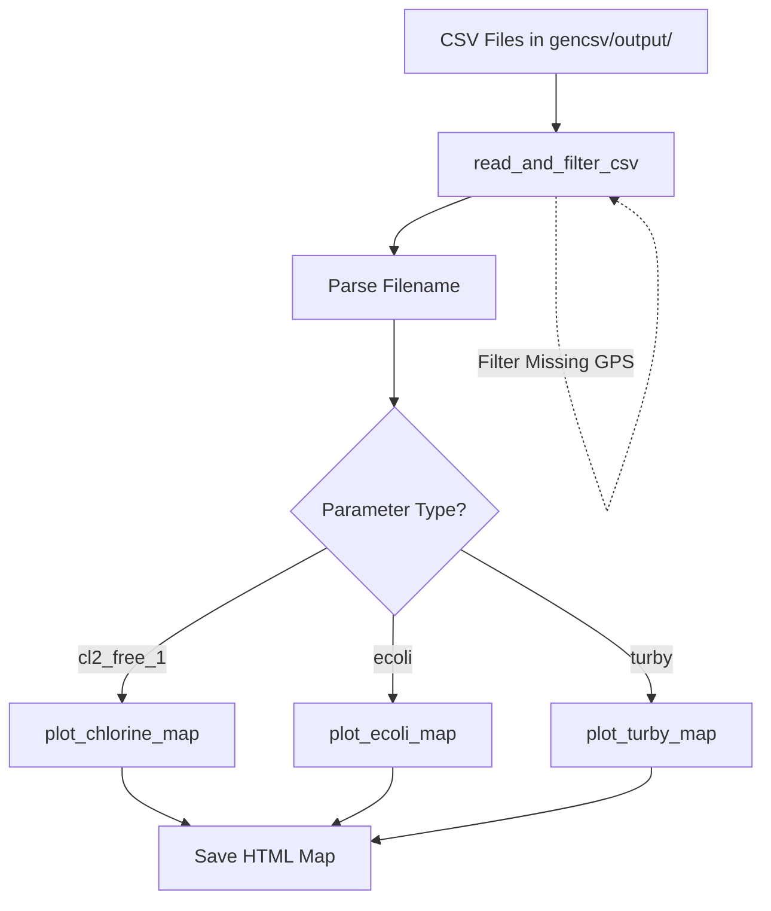

# Location Mapping Architecture Plan

## Overview
Create a Python script to generate interactive location maps from CSV files in `gencsv/output/` directory. Each CSV file contains water quality monitoring data with GPS coordinates.

## Requirements

### Input Data
- **Source**: CSV files in `gencsv/output/` directory
- **File Naming Pattern**: `{parameter}_{date_range}_{timestamp}.csv`
  - Examples:
    - `cl2_free_1_2025-10-19_2025-11-01_20260327_184448.csv`
    - `ecoli_2025-10-19_2025-11-01_20260327_180351.csv`
    - `turby_2025-10-19_2025-11-01_20260327_180351.csv`

### Key Data Fields
- `sampno` - Sample number
- `loccode` - Location code
- `locdescr` - Location description
- `coldate` - Collection date
- `owner` - Owner (not always present)
- `district` - District
- `loc_gps_latitude` - GPS latitude
- `loc_gps_longitude` - GPS longitude
- `result` - Test result value

### Processing Requirements
1. **Filter GPS**: Omit data points with missing GPS coordinates
2. **One Map Per File**: Generate one interactive HTML map for each CSV file
3. **Parameter-Specific Functions**: Create three functions for plotting maps for each parameter type
4. **Color Coding**: Use appropriate color schemes based on result values

## Architecture Design

### Module Structure
```
maps/
├── location_mapper.py    # Main mapping script
├── output/               # Generated HTML maps (new directory)
└── README.md             # Documentation
```

### Function Design

#### 1. `read_and_filter_csv(csv_path: str) -> DataFrame`
**Purpose**: Read CSV file and filter out entries with missing GPS coordinates

**Input**: CSV file path

**Output**: Filtered pandas DataFrame

**Logic**:
- Read CSV file
- Check for owner column (not always present)
- Filter rows where `loc_gps_latitude` and `loc_gps_longitude` are valid (not NaN/empty)
- Return cleaned DataFrame

**Progress Reporting**:
- Print total rows read
- Print rows filtered out (missing GPS)
- Print rows kept for mapping

**Error Handling**:
- File not found
- CSV parsing errors
- Missing required columns

#### 2. `plot_chlorine_map(df: DataFrame, parameter_name: str, date_range: str, output_path: str) -> str`
**Purpose**: Create interactive map for chlorine (cl2_free_1) parameter

**Parameters**:
- `df`: Filtered DataFrame with GPS data
- `parameter_name`: Extracted from filename (e.g., "cl2_free_1")
- `date_range`: Extracted from filename (e.g., "2025-10-19_2025-11-01")
- `output_path`: Where to save the HTML file

**Color Scheme** (based on chlorine levels in mg/L):
- `green`: ≤ 0.5 mg/L (excellent)
- `lightgreen`: 0.5 - 1.0 mg/L (good)
- `orange`: 1.0 - 1.5 mg/L (moderate)
- `orangered`: 1.5 - 2.0 mg/L (elevated)
- `red`: > 2.0 mg/L (high)
- `gray`: Missing/null value

**Map Features**:
- Center map on mean coordinates of all points
- Circle markers with color-coded results
- Popup displays: Sample #, Location Code, Description, District, Collection Date, Result (mg/L), Owner (if available)
- Tooltip shows: Location description and result value

#### 3. `plot_ecoli_map(df: DataFrame, parameter: str, date_range: str, output_path: str) -> str`
**Purpose**: Create interactive map for E. coli (ecoli) parameter

**Color Scheme** (based on E. coli count):
- `green`: 0 (not detected)
- `lightgreen`: 1 - 10 (low)
- `orange`: 11 - 100 (moderate)
- `orangered`: 101 - 500 (elevated)
- `red`: > 500 (high)
- `gray`: Missing/null value

**Popup Format**: Similar to chlorine, result shown as "E. coli: {count} CFU/100mL"

#### 4. `plot_turby_map(df: DataFrame, parameter: str, date_range: str, output_path: str) -> str`
**Purpose**: Create interactive map for turbidity (turby) parameter

**Color Scheme** (based on turbidity in NTU):
- `green`: ≤ 1.0 NTU (excellent)
- `lightgreen`: 1.0 - 2.5 NTU (good)
- `orange`: 2.5 - 5.0 NTU (moderate)
- `orangered`: 5.0 - 10.0 NTU (elevated)
- `red`: > 10.0 NTU (high)
- `gray`: Missing/null value

**Popup Format**: Similar to chlorine, result shown as "Turbidity: {value} NTU"

#### 5. `parse_filename(filename: str) -> dict`
**Purpose**: Extract parameter name and date range from filename

**Input**: Filename string

**Output**: Dictionary with keys:
- `parameter`: Parameter name (e.g., "cl2_free_1", "ecoli", "turby")
- `date_range`: Date range (e.g., "2025-10-19_2025-11-01")

#### 6. `process_all_csv_files(input_dir: str, output_dir: str) -> None`
**Purpose**: Process all CSV files in input directory and generate maps

**Logic**:
- List .csv files in input directory
- For each file (with progress tracking):
  - Display: "Processing [current/total]: filename (X%)"
  - Parse filename to get parameter and date range
  - Read and filter CSV (show rows read, filtered, kept)
  - Call appropriate plotting function based on parameter
  - Save HTML map to output directory
  - Log success/failure
- Display summary: "Completed: X/Y files processed, Z maps generated"

#### 7. `main() -> None`
**Purpose**: Main entry point

**Logic**:
- Set default input/output directories
- Create output directory if doesn't exist
- Display: "Starting location map generation..."
- Display: "Input directory: {input_dir}"
- Display: "Output directory: {output_dir}"
- Call `process_all_csv_files()`
- Display final summary with success count and error count

## Data Flow Diagram



## Implementation Details

### Dependencies
- `pandas` - CSV reading and data manipulation
- `folium` - Interactive map generation

### File Naming Convention for Output
Output HTML files will be named: `{parameter}_{date_range}_map.html`
Example: `cl2_free_1_2025-10-19_2025-11-01_map.html`

### Error Handling Strategy
1. **File Level**: Skip files with read errors, log error message
2. **Row Level**: Skip rows with invalid GPS coordinates, count skipped rows
3. **Data Validation**: Validate result values are numeric
4. **Logging**: Print progress for each file processed

## Color Coding Reference Table

| Parameter | Level | Color | Interpretation |
|-----------|-------|-------|----------------|
| Chlorine | ≤ 0.5 mg/L | green | Excellent |
| Chlorine | 0.5 - 1.0 mg/L | lightgreen | Good |
| Chlorine | 1.0 - 1.5 mg/L | orange | Moderate |
| Chlorine | 1.5 - 2.0 mg/L | orangered | Elevated |
| Chlorine | > 2.0 mg/L | red | High |
| E. coli | 0 CFU/100mL | green | Not Detected |
| E. coli | 1 - 10 CFU/100mL | lightgreen | Low |
| E. coli | 11 - 100 CFU/100mL | orange | Moderate |
| E. coli | 101 - 500 CFU/100mL | orangered | Elevated |
| E. coli | > 500 CFU/100mL | red | High |
| Turbidity | ≤ 1.0 NTU | green | Excellent |
| Turbidity | 1.0 - 2.5 NTU | lightgreen | Good |
| Turbidity | 2.5 - 5.0 NTU | orange | Moderate |
| Turbidity | 5.0 - 10.0 NTU | orangered | Elevated |
| Turbidity | > 10.0 NTU | red | High |
| All | Missing | gray | No Data |

## Usage Example
```bash
python maps/location_mapper.py
```

Or process specific file:
```python
from location_mapper import plot_chlorine_map
plot_chlorine_map(df, 'cl2_free_1', '2025-10-19_2025-11-01', 'output.html')
```

## Notes
- Hong Kong approximate center: 22.3193° N, 114.1694° E (used as fallback if no valid data)
- Missing GPS coordinates are common and expected to be filtered out
- Some CSV files have `locdescr` column, others have `locdesc` - handle both
- Some CSV files have `owner` column, others don't - handle optional field
