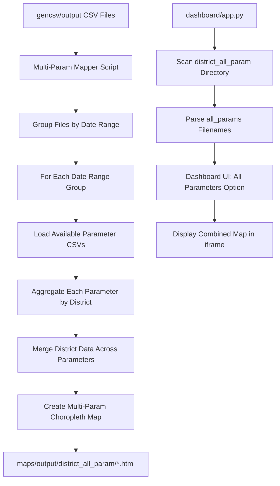

# Multi-Parameter District Map Generation Plan

## Objective

Generate district-level maps that aggregate all 3 water quality parameters (Free Chlorine, E. coli, Turbidity) into a single map file per date range, instead of 3 separate files. When hovering over a district, the tooltip displays all available parameter values (as averages). Maps are generated even if some parameters are missing for a given date range.

## Current System Overview

### Data Pipeline

```
gencsv/date_range_runner.py  →  gencsv/output/*.csv  →  maps/location_mapper.py  →  maps/output/district/*.html
                                                                    ↓
                                                         maps/output/detailed/*.html
```

### Current File Structure

| Component | Path | Purpose |
|-----------|------|---------|
| CSV Input | `gencsv/output/` | Parameter CSV files with date ranges in filenames |
| Map Generator | `maps/location_mapper.py` | Main script; processes each CSV individually |
| District Aggregator | `maps/district_aggregator.py` | Aggregates data by HK 18 districts |
| Choropleth Mapper | `maps/choropleth_mapper.py` | Creates Folium choropleth HTML maps |
| District Maps Output | `maps/output/district/` | Per-parameter district maps |
| Detailed Maps Output | `maps/output/detailed/` | Per-parameter point maps |
| Dashboard Backend | `dashboard/app.py` | Flask API serving map metadata and files |
| Dashboard Frontend | `dashboard/static/js/dashboard.js` | UI for parameter/date selection |

### Current Filename Patterns

**CSV**: `{parameter}_{date_from}_{date_to}_{timestamp}.csv`
- e.g., `cl2_free_1_2025-10-26_2025-11-01_20260427_165324.csv`
- e.g., `ecoli_2025-10-26_2025-11-01_20260427_165325.csv`

**District Map HTML**: `{parameter}_{date_from}_{date_to}_{timestamp}_district_map.html`
- e.g., `cl2_free_1_2025-10-26_2025-11-01_20260427_165324_district_map.html`

### Current Per-Parameter Aggregation Logic

| Parameter | Value Column | Aggregation | Unit |
|-----------|-------------|-------------|------|
| cl2_free_1 | mean | Average of result values | mg/L |
| ecoli | contamination_rate | % of samples with result > 0 | % |
| turby | mean | Average of result values | NTU |

## Proposed Design

### New Output

- **Directory**: `maps/output/district_all_param/`
- **Filename**: `all_params_{date_from}_{date_to}_{timestamp}_district_map.html`
- e.g., `all_params_2025-10-26_2025-11-01_20260427_170000_district_map.html`

### Architecture



### Implementation Steps

#### Step 1: Create `maps/multi_param_mapper.py` — New Map Generation Script

This is the main new script. It:

1. **Scans** `gencsv/output/` for all CSV files
2. **Parses filenames** to extract parameter name and date range using existing `parse_filename()` logic from `location_mapper.py`
3. **Groups files** by date range `{date_from}_{date_to}`
4. **For each date range group**:
   - Loads available parameter CSVs (any subset of cl2_free_1, ecoli, turby)
   - Calls `aggregate_water_quality()` for each available parameter
   - Merges the district-level results into a combined data structure
   - Calls a new `create_multi_param_choropleth_map()` function
5. **Saves** output to `maps/output/district_all_param/`

Key function - `group_csvs_by_date_range()`:
```python
def group_csvs_by_date_range(csv_dir: Path) -> dict:
    """
    Group CSV files by date range.
    
    Returns:
        dict: {date_range_key: {parameter: csv_path}}
        e.g., {'2025-10-26_2025-11-01': {'cl2_free_1': Path(...), 'ecoli': Path(...), 'turby': Path(...)}}
    """
```

Key function - `merge_district_stats()`:
```python
def merge_district_stats(param_stats: dict) -> dict:
    """
    Merge district statistics from multiple parameters.
    
    Args:
        param_stats: {parameter: district_stats_dataframe}
    
    Returns:
        dict: {district_name: {param_name: {avg, max, count, unit, display_name}}}
    """
```

#### Step 2: Add `create_multi_param_choropleth_map()` to `maps/choropleth_mapper.py`

A new function that creates a Folium choropleth map displaying all parameters:

- **Choropleth coloring**: Uses the first available parameter in priority order (cl2_free_1 → ecoli → turby) for district fill colors
- **Tooltip**: Shows district name + all available parameter averages with clear **Avg** labels
- **Popup**: Detailed view with avg, max, sample count per parameter
- **Legend**: Lists all parameters with **Avg** indicator and their units
- **Title/Info Panel**: States which parameters are included and that values are averages

Tooltip format:
```
Central & Western 中西區
──────────────────────
Free Chlorine (Avg): 0.450 mg/L
E. coli Contamination (Avg): 2.3%
Turbidity (Avg): 0.280 NTU
──────────────────────
Samples: Cl₂: 15, E.coli: 12, Turbidity: 18
```

If a parameter is missing:
```
Free Chlorine (Avg): 0.450 mg/L
E. coli (Avg): No data
Turbidity (Avg): 0.280 NTU
```

Legend format:
```
Water Quality Parameters - Average Values
━━━━━━━━━━━━━━━━━━━━━━━━━━━━━━━━━━━━━━━━
🟦 Free Chlorine (Avg): 0.0 - 2.0 mg/L
🟩 E. coli Contam. (Avg): 0% - 100%
🟨 Turbidity (Avg): 0.0 - 5.0 NTU

Note: All values are district averages
Colors based on: Free Chlorine (Avg)
```

#### Step 3: Update `dashboard/app.py`

Changes needed:

1. **`parse_filename()`**: Add support for `all_params` parameter type and `_district_map.html` suffix in `district_all_param` directory
2. **`scan_maps_directory()`**: Add scanning of `maps/output/district_all_param/` directory alongside existing `district/` scan
3. **`PARAMETER_INFO`**: Add `all_params` entry:
   ```python
   'all_params': {
       'display_name': 'All Parameters',
       'unit': 'Multi'
   }
   ```
4. **`serve_map_with_view_type()`**: Add `district_all_param` as a valid view type
5. **New API endpoint** or extend `/api/maps` to include multi-param maps in the response

#### Step 4: Update `dashboard/static/js/dashboard.js`

Changes needed:

1. **`ParameterInfo`**: Add `all_params` entry with appropriate display name and color
2. **`processMapsData()`**: Handle `all_params` as a parameter group
3. **Map display**: When `all_params` is selected, load maps from `district_all_param` directory via iframe

#### Step 5: Update `dashboard/templates/dashboard.html`

Minor updates if needed for the All Parameters option in the UI.

### Key Design Decisions

| Decision | Choice | Rationale |
|----------|--------|-----------|
| New script vs modify existing | New script `multi_param_mapper.py` | Separation of concerns; existing single-param flow unchanged |
| Choropleth color basis | First available param in priority order | Simple; consistent with existing color logic |
| Missing parameter display | Show parameter name with No data | User can see what should be there |
| Avg label placement | In tooltip, legend, and title | Triple reinforcement of aggregation method |
| Output directory | `maps/output/district_all_param/` | As specified; separate from existing district maps |
| Dashboard integration | Add as new parameter option All Parameters | Natural extension of existing UI pattern |
| Existing maps | Keep unchanged | Backward compatibility; single-param maps still useful |

### Files to Create/Modify

| File | Action | Description |
|------|--------|-------------|
| `maps/multi_param_mapper.py` | CREATE | New main script for multi-param map generation |
| `maps/choropleth_mapper.py` | MODIFY | Add `create_multi_param_choropleth_map()` function |
| `maps/district_aggregator.py` | MODIFY MINOR | Potentially add `aggregate_all_parameters()` helper |
| `dashboard/app.py` | MODIFY | Add `all_params` parsing, scanning, and serving |
| `dashboard/static/js/dashboard.js` | MODIFY | Add `all_params` to ParameterInfo and UI handling |
| `dashboard/templates/dashboard.html` | MODIFY MINOR | If UI changes needed for All Parameters |
| `maps/output/district_all_param/` | CREATE DIR | Output directory for combined maps |

### Testing Approach

1. Run `multi_param_mapper.py` against existing CSV data in `gencsv/output/`
2. Verify generated HTML maps in `maps/output/district_all_param/`
3. Open map HTML directly in browser to check tooltips, popups, legend
4. Test with deliberately removed parameter files to verify graceful missing data handling
5. Start dashboard and verify All Parameters option appears and loads maps correctly
6. Test dashboard API response includes multi-param maps
